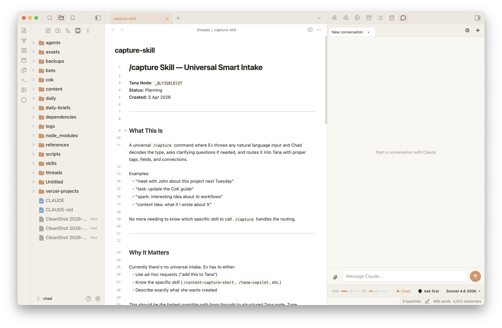

# Hyo — Claude Code Agent

**The power of Claude Code — without the terminal.**



If you want to use Claude Code inside Obsidian but the terminal isn't your thing, Hyo gives you everything Claude Code can do — full agent capability, MCP tools, multi-step reasoning — wrapped in a clean chat interface right inside your notes.

No separate app, no extra billing — Hyo runs on your existing Claude login, not a pay-per-use API key. Just Claude, living in your vault.

---

## Features

- **Multiple conversation tabs** — run parallel conversations or keep different projects separate
- **Past sessions browser** — pick up any previous conversation right where you left off
- **Usage tracking** — see how much of your Claude plan you've used (5-hour window + 7-day)
- **Context window display** — visual indicator of how much conversation context is in use
- **Model switcher** — choose between Opus, Sonnet, and Haiku; 200K or 1M context
- **Permission modes** — control what Claude can do: ask every time, auto-edit, or hands-off
- **Slash commands** — load skills, compact your conversation, and more
- **File attachments** — attach the file you're currently editing with one click, or any text/image file
- **Inline permission prompts** — approve or deny Claude's tool requests without leaving the chat
- **Markdown rendering** — Claude's responses render as rich markdown, not raw text

---

→ **[Full setup guide with Claude Desktop install prompt](SETUP.md)**

---

## Requirements

- [Obsidian](https://obsidian.md) (desktop only)
- A Claude account — Pro, Max, Team, or Enterprise ([claude.ai](https://claude.ai))
- Claude Code CLI (the plugin will walk you through installing it if needed)

---

## Installation

Hyo is a beta plugin, so it installs via **BRAT** (Beta Reviewers Auto-update Tool).

**Step 1: Install BRAT**
In Obsidian, go to Settings → Community Plugins → Browse, search for "BRAT", install and enable it.

**Step 2: Add Hyo**
Go to Settings → BRAT → Add Beta Plugin, paste in:
```
https://github.com/evielync/hyo-claude-code-obsidian-plugin
```
Click **Add Plugin**.

**Step 3: Enable it**
Go to Settings → Community Plugins, find **Hyo Claude Code Agent**, and enable it.

**Step 4: Open Hyo**
Press `Cmd+Shift+H` (Mac) or `Ctrl+Shift+H` (Windows). If Claude Code isn't installed yet, the plugin will show you exactly how to set it up.

---

## How it works

Hyo runs Claude Code CLI as a background process and streams the conversation into Obsidian. Your vault root is Claude's working directory by default — so Claude can read and edit your notes, run tools, and use any MCP servers you've configured.

If your Claude project lives in a different folder, you can point Hyo there: Settings → Hyo Claude Code Agent → Advanced → Working directory.

---

## Network use & privacy

Hyo is transparent about every network connection it makes:

- **Anthropic (Claude)** — the plugin runs the Claude Code CLI, which connects to Anthropic using your existing Claude login. Your messages and any vault content you choose to share are sent to Anthropic under your own Claude account, subject to [Anthropic's terms](https://www.anthropic.com/legal). Hyo also reads your Claude usage stats from Anthropic's API to power the usage meter.
- **ElevenLabs (optional voice)** — the voice feature is **off by default**. If you turn it on, your microphone audio and message text are sent to ElevenLabs for speech-to-text and text-to-speech, using an ElevenLabs API key that you provide in settings.
- **No telemetry** — Hyo collects no analytics and sends no data anywhere else. Nothing leaves your machine unless you're actively using the plugin.

Credentials (your ElevenLabs key and cached Claude tokens) are stored locally in the plugin's data and are never transmitted except to the services above.

---

## Built by

[Ev Chapman](https://evchapman.com) — teaching knowledge workers to build in partnership with AI.

Part of the [College of Knowledge](https://evchapman.com/cok) community.
